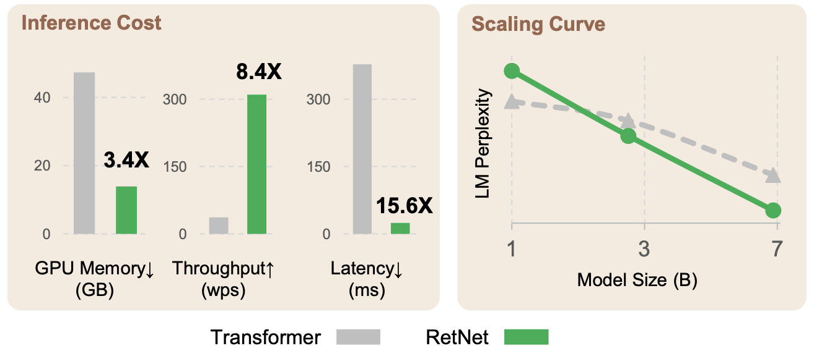
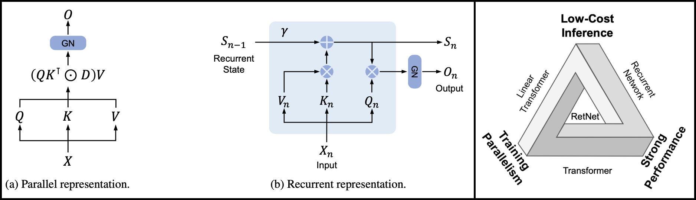

# Retention Network in Easy PyTorch

A simple and concise implementation of [Retentive Networks](https://arxiv.org/abs/2307.08621) as introduced in *Retentive Network: A Successor to Transformer for Large Language Models* (2023). Note that the official implementation is hosted here: [Ret-Net @ microsoft/torchscale](https://github.com/microsoft/torchscale/blob/main/torchscale/architecture/retnet.py), however this repo provides a standalone and well documented version that can be useful for didactic purposes.



# Model Architecture

The Retentive Network (Ret-Net) is a Transformer architecture that supports two equivalent formulations for the attention mechanism:

- **Parallel** attention: the attention mechanism is applied to the full sequence in parallel.
- **Recurrent/Chunk-wise** attention: the attention mechanism is applied to individual sequence chunks sequentially.

The two formulations are equivalent in terms of the final output, however they offer different computational tradeoffs. The `parallel` formulation offers high training throughput, while the `recurrent` formulation improves both memory cost and throughput (smaller latency) at inference time. The Retentive architecture achieves similar scaling law as the Transformer architecture, thus achieving the "impossible triangle" of having training parallelism (good use of GPUs), low-cost inference and strong performances, all the same time.



# Usage

Basic usage of the RetNet model:

```python
import torch
from src.retnet import RetNet

batch_size = 2
seq_length = 1024
dim_model = 512

model = RetNet(
    num_layer = 6,
    num_heads = 8,
    dim_model = dim_model,
    dropout = 0.1,
    value_factor = 2,
    msr_gate_fn = 'gelu',
    mlp_gate_fn = 'gelu',
    mlp_mult = 4,
    mlp_bias = True,
).cuda()

x = torch.randint(0, 100, (batch_size, seq_length, dim_model), dtype=torch.float32)

# Use num_chunks parameter to switch between the parallel and recurrent forward passes.
parallel_forward  = model(x, attn_mask='causal', num_chunks = None)
recurrent_forward = model(x, attn_mask='causal', num_chunks = 8)

# The two formulations should be consistent
assert torch.allclose(parallel_forward, recurrent_forward)
```

Model now has support for both attention mask and retention matrix normalizations as described in the paper.

```python

# This is the default model behavior
no_nomalization_forward = model(x, attn_mask='causal', normalize_attn=False, normalize_retn=False, num_chunks = None)

# Normalization can be switched on independently
# ! Please NOTE that normalize_attn=True currently breaks consistency between parallel and recurrent forward
only_attn_norm_forward = model(x, attn_mask='causal', normalize_attn=True, normalize_retn=False, num_chunks = None) 
only_retn_norm_forward = model(x, attn_mask='causal', normalize_attn=False, normalize_retn=True, num_chunks = None)
```

### Multi-Scale Retention

One can use the `MultiScaleRetention` module as a standalone replacement for a standard attention layer. Again it supports both parallel and recurrent forward passes.

```python
from src.retnet import MultiScaleRetention

batch_size = 2
seq_length = 1024
dim_model = 512

msr = MultiScaleRetention(
    dim_model = dim_model,
    num_heads = 8,
    gate_fn = 'gelu',
    value_factor = 2,
)

x = torch.randint(0, 100, (batch_size, seq_length, dim_model), dtype=torch.float32)

# Use num_chunks parameter to switch between the parallel and recurrent forward passes.
parallel_forward  = model(x, num_chunks = None)
recurrent_forward = model(x, num_chunks = 8)

# The two formulations should be consistent
assert torch.allclose(parallel_forward, recurrent_forward)
```

# Known Issues

- Consistency between `parallel` and `recurrent` formulation breaks down if attention mask is normalized as suggested in the original paper (normalization #2 in the paper).
- Consistency between `parallel` and `recurrent` formulation seems unstable when a large number of `chunks` is used. This is possibly due to numerical errors that accumulate.

# Citations

This code is based on the official [authors' implementation](https://aka.ms/retnet), which is part of the larger `torchscale` codebase.

```bibtex
@article{sun2023retentive,
  title={Retentive Network: A Successor to Transformer for Large Language Models},
  author={Sun, Yutao and Dong, Li and Huang, Shaohan and Ma, Shuming and Xia, Yuqing and Xue, Jilong and Wang, Jianyong and Wei, Furu},
  journal={arXiv preprint arXiv:2307.08621},
  year={2023}
}
```